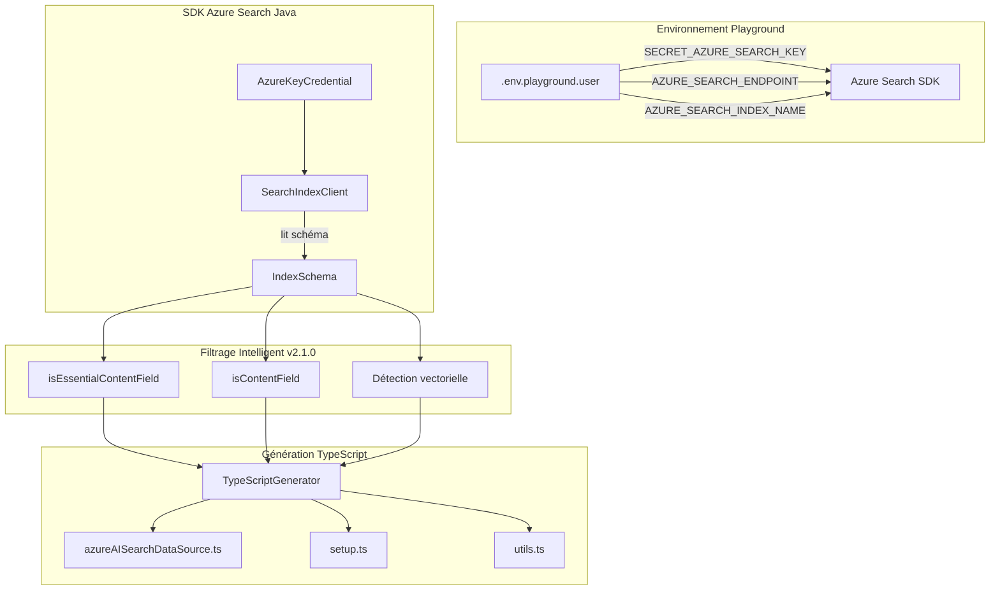

# 📚 Documentation - Chatbot Legis QC - Index Configurator v2.1.0

Bienvenue dans la documentation complète du projet **Chatbot Legis QC** - Un agent conversationnel Microsoft 365 Teams avec **utilitaire Java de nouvelle génération** utilisant le SDK Azure Search officiel pour génération automatique de configuration TypeScript.

## 🆕 Nouveautés version 2.1.0

### 🚀 Intégration SDK Azure Search Java officiel
- **SearchIndexClient** - Remplacement des appels REST API manuels
- **AzureKeyCredential** - Authentification enterprise-grade
- **Compatibilité API maximale** - Filtrage intelligent des champs

### 🎯 Filtrage intelligent des champs
- **isEssentialContentField()** - Sélection ultra-conservative (content, title uniquement)
- **isContentField()** - Détection automatique des champs de contenu
- **Gestion vectorielle** - Détection et traitement automatique des champs vectoriels

### 🧪 Suite de tests étendue (67 tests)
- **Tests d'intégration renforcés** avec Azure Search réel
- **Validation SDK** - Tests spécialisés SearchIndexClient  
- **Tests de compatibilité API** - Prévention erreurs de champs

## 🗂️ Organisation de la documentation

### 📖 Guides utilisateur v2.1.0
- **[azure-search-config-generator.md](./azure-search-config-generator.md)** - Guide complet de l'utilitaire Java avec SDK Azure Search
- **[azure-search-sdk-migration.md](./azure-search-sdk-migration.md)** - 🆕 Migration vers SDK Azure Search Java officiel  
- **[azure-search-management.md](./azure-search-management.md)** - Guide complet de gestion de l'index Azure AI Search
- **[setup-guide.md](./setup-guide.md)** - Guide d'installation et configuration pas à pas v2.1.0

### 🔧 Référence technique v2.1.0
- **[scripts-reference.md](./scripts-reference.md)** - Documentation technique détaillée des scripts
- **[large-scale-validation-strategy.md](./large-scale-validation-strategy.md)** - Stratégie de validation à grande échelle
- **[NAMING_CONVENTIONS.md](./NAMING_CONVENTIONS.md)** - Conventions de nommage du projet

## 🚀 Démarrage rapide

### Nouveaux utilisateurs
1. 📋 Lire le [Guide d'installation](./setup-guide.md)
2. ⚙️ Découvrir l'[Azure Search Config Generator](./azure-search-config-generator.md)
3. 🛠️ Suivre la [Configuration Azure Search](./azure-search-management.md#configuration-requise)
4. ⚡ Exécuter `make help` pour voir toutes les commandes disponibles

### Utilisateurs expérimentés
```bash
# Configuration rapide
make java-build && make check-env && make validate-config

# Génération automatique TypeScript depuis Azure Search
make azure-config-generate

# Setup complet avec génération
make azure-config-workflow

# Démarrage de l'application
make dev
```

## 🎯 Architecture du projet

```
## 🎯 Architecture du projet v2.1.0

```
📁 Chatbot Legis QC - Index Configurator v2.1.0
├── ☕ src/main/java/com/cotechnoe/teamsrag/indexconfigurator/  # Utilitaire Java SDK
│   ├── AzureSearchConfigGenerator.java      # CLI principal avec validation
│   ├── azure/AzureSearchIndexReader.java    # SDK Azure Search officiel
│   ├── generator/TypeScriptGenerator.java   # Générateur avec filtrage intelligent
│   └── model/{IndexSchema,FieldDefinition}  # Modèles enrichis v2.1.0
├── 🧪 src/test/java/.../indexconfigurator/  # Tests TDD 67 tests complets
│   ├── AzureSearchConfigGeneratorTest.java  # Tests CLI
│   ├── azure/AzureSearchIndexReaderTest.java # Tests SDK intégration
│   └── generator/TypeScriptGeneratorTest.java # Tests génération
├── 🔧 scripts/                             # Scripts d'automatisation
├── 📚 docs/                                # Documentation (ce répertoire)
├── 🗃️ src/indexers/                        # Logique d'indexation Azure Search
├── 🎯 src/app/azureAISearchDataSource.ts   # Configuration générée dynamiquement
└── ⚙️ Maven dependencies                   # com.azure:azure-search-documents
```

### 🔧 Workflow de génération v2.1.0


├── 🤖 src/app/                             # Logique applicative Teams Bot
├── 🏗️ infra/                              # Infrastructure Azure (Bicep)
└── 📄 Makefile                            # Commandes de gestion automatisées
```

## 🛠️ Fonctionnalités principales

### ⚙️ Génération TypeScript automatique
- **Lecture dynamique** : Structure d'index Azure Search en temps réel
- **Génération intelligente** : Mode simple (placeholders) et avancé (START/END)
- **Préservation métier** : Logique existante protégée lors des mises à jour
- **Validation** : Tests TDD complets et vérification de syntaxe TypeScript

### 🔍 Recherche hybride
- **Recherche textuelle** : Correspondance exacte des mots-clés
- **Recherche sémantique** : Similarité vectorielle via embeddings Azure OpenAI

### 🧪 Développement TDD
- **31 tests JUnit 5** avec couverture complète
- **Architecture SOLID** : Injection de dépendances, immutabilité
- **Compatibilité Eclipse** : Développement intégré Maven

## 📋 Commandes essentielles

### Configuration initiale
```bash
make install              # Installation des dépendances
make check-env           # Validation de l'environnement
make validate-config     # Test de connectivité Azure
```

### Gestion de l'index
```bash
make setup-index         # Création et indexation
make index-status        # Vérification du statut
make add-documents       # Ajout de nouveaux documents
make reindex            # Reconstruction complète
```

### Développement
```bash
make build              # Compilation TypeScript
make dev               # Démarrage en mode développement
make clean             # Nettoyage des artefacts
```

## 🔐 Configuration Azure

### Services requis
- **Azure AI Search** (Standard S1+ recommandé)
- **Azure OpenAI** avec modèles :
  - `gpt-4-mini` (ou équivalent)
  - `text-embedding-ada-002` (ou text-embedding-3-small)

### Variables d'environnement
```bash
# Azure AI Search
AZURE_SEARCH_ENDPOINT=https://your-service.search.windows.net/
SECRET_AZURE_SEARCH_KEY=your_admin_key

# Azure OpenAI
AZURE_OPENAI_ENDPOINT=https://your-openai.openai.azure.com/
SECRET_AZURE_OPENAI_API_KEY=your_api_key
AZURE_OPENAI_DEPLOYMENT_NAME=gpt-4-mini
AZURE_OPENAI_EMBEDDING_DEPLOYMENT_NAME=text-embedding-ada-002
```

## 🔄 Workflow de développement

### 1. Ajout de nouveaux documents
```bash
# 1. Placer les fichiers .md dans src/indexers/new-data/
# 2. Indexer
make add-documents AZURE_SEARCH_KEY=key AZURE_OPENAI_KEY=key
```

### 2. Test et validation
```bash
# Vérifier l'index
make index-status AZURE_SEARCH_KEY=key

# Démarrer l'application
make dev
```

### 3. Déploiement
```bash
# Build pour production
make build

# Déploiement (selon votre pipeline)
# Par exemple avec Azure DevOps, GitHub Actions, etc.
```

## 🚨 Dépannage rapide

### Erreurs communes
| Problème | Commande de diagnostic | Solution |
|----------|----------------------|----------|
| Variables manquantes | `make check-env` | Configurer les variables d'environnement |
| Connectivité Azure | `make validate-config` | Vérifier les endpoints et clés |
| Index inexistant | `make index-status` | Exécuter `make setup-index` |
| Build échoué | `make clean && make build` | Nettoyer et recompiler |

### Support et ressources
- 📖 **Documentation Microsoft** : [Azure AI Search](https://docs.microsoft.com/azure/search/)
- 🛠️ **Teams Toolkit** : [Microsoft Teams Toolkit](https://docs.microsoft.com/microsoftteams/platform/toolkit/)
- 💡 **Exemples** : [Azure Search Vector Samples](https://github.com/Azure/azure-search-vector-samples)

## 🎓 Apprentissage et formation

### Pour les débutants
1. 📚 Comprendre les concepts RAG et vector search
2. 🏗️ Découvrir l'architecture Azure AI Search
3. 🤖 Explorer le développement d'agents Teams

### Pour les développeurs expérimentés
1. 🔧 Personnaliser les scripts d'indexation
2. 📊 Optimiser les performances de recherche
3. 🚀 Implémenter des fonctionnalités avancées

## 🔄 Mise à jour de la documentation

Cette documentation est maintenue activement. Pour contribuer :

1. **Corrections** : Créer une issue ou PR
2. **Améliorations** : Proposer des ajouts via PR
3. **Questions** : Utiliser les discussions GitHub

---

**Version** : 1.0.0  
**Dernière mise à jour** : Août 2025  
**Projet** : [Chatbot Legis QC](https://github.com/michel-heon/chatbottez-legis-qc)