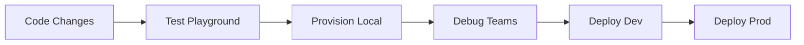

# ADR 002: Utilisation de Microsoft 365 Agents Toolkit comme Chaîne d'Outils de Développement

## Statut

✅ Accepté

## Date

2025-12-11

## Contexte

Le projet Légis Québec migre vers une architecture **Custom Engine Agent** pour Microsoft 365 Copilot. Cette migration nécessite :

1. **Outillage de développement** adapté aux agents Microsoft 365
2. **Gestion du cycle de vie** : provisionning, déploiement, tests, debugging
3. **Alignement avec les bonnes pratiques Microsoft** pour garantir la certification
4. **Environnement de développement cohérent** pour l'équipe
5. **Support des workflows CI/CD** pour déploiements automatisés

### Problématique

Développer un Custom Engine Agent pour Microsoft 365 Copilot implique :

- Configuration complexe de Azure Bot Service
- Gestion des manifests d'application (v1.24+)
- Provisionning de ressources Azure (Bot Registration, App Service, etc.)
- Déploiement multi-environnements (local, playground, dev, prod)
- Tests dans Microsoft 365 Agents Playground et Teams
- Conformité aux standards de sécurité Microsoft 365

**Sans outillage approprié**, le développement devient :
- ❌ Sujet aux erreurs de configuration manuelle
- ❌ Difficile à reproduire entre environnements
- ❌ Non aligné avec les bonnes pratiques Microsoft
- ❌ Complexe pour l'onboarding de nouveaux développeurs
- ❌ Incompatible avec les processus de certification Microsoft

### Contraintes Techniques

- **OS de développement** : Windows (cloud RDP depuis MacOS)
- **Terminal** : Git Bash (configuré dans ADR-001)
- **Node.js** : v24.11.1 (supporté par Microsoft 365 Agents Toolkit)
- **IDE** : Visual Studio Code
- **Contrôle de version** : Git (GitHub)

## Décision

Adopter **Microsoft 365 Agents Toolkit** (extension VS Code) comme chaîne d'outils principale pour le développement, le déploiement et les tests du Custom Engine Agent Légis Québec.

### Composants de la Solution

#### 1. Extension VS Code : Microsoft 365 Agents Toolkit

**Rôle** : Orchestrateur principal du cycle de vie de développement

**Fonctionnalités utilisées** :
- Scaffolding de projets agents (templates officiels)
- Gestion des manifests (`manifest.json`, `ai-plugin.json`)
- Provisionning automatique des ressources Azure
- Déploiement multi-environnements via `m365agents.*.yml`
- Debugging local avec tunnels (dev-tunnel)
- Lancement de Microsoft 365 Agents Playground
- Validation de conformité Microsoft 365

#### 2. Fichiers de Configuration (`m365agents.yml`)

**Environnements supportés** :

```yaml
m365agents.yml            # Configuration racine
m365agents.local.yml      # Développement local
m365agents.playground.yml # Tests dans Playground
m365agents.dev.yml        # Environnement dev Azure
m365agents.cotechnoe.yml  # Production Cotechnoe
```

**Fonctions** :
- Définition des actions de provisionning (Bicep, ARM)
- Configuration des déploiements (npm scripts, fichiers)
- Gestion des variables d'environnement par environnement
- Orchestration des tunnels locaux (dev-tunnel pour webhook Bot)

#### 3. Microsoft 365 Agents Playground

**Rôle** : Environnement de test isolé (pas de déploiement Azure requis)

**Utilisation** :
- Tests rapides des modifications de code
- Validation des réponses RAG
- Tests de streaming et citations
- Debugging sans coûts Azure

**Commande** : Task VS Code `Start Agent in Microsoft 365 Agents Playground`

#### 4. Git Bash comme Terminal

**Justification** :
- Conformité avec ADR-001 (workflow Git)
- Compatibilité avec scripts shell Microsoft 365 Agents Toolkit
- Expérience cohérente entre MacOS (développement primaire) et Windows (cloud)
- Support des commandes Unix standards (cp, mv, grep, etc.)

### Workflow de Développement



#### Cycle de développement standard :

1. **Modification code** : Édition dans `src/` avec VS Code
2. **Test rapide** : `Start Agent in Microsoft 365 Agents Playground` (Task)
3. **Debug local** : `Start Agent Locally` avec dev-tunnel
4. **Provisionning** : Automatique via `m365agents.local.yml`
5. **Déploiement** : Tasks configurées par environnement

### Bonnes Pratiques Microsoft Appliquées

#### ✅ Architecture

- Utilisation de **Custom Engine Agent** (recommandation Microsoft 2025+)
- RAG via **Azure OpenAI Extensions** (pattern officiel)
- Manifests **v1.24** avec `copilotAgents.customEngineAgents`

#### ✅ Développement

- Templates officiels Microsoft comme base
- Structure de projet standard (`src/`, `appPackage/`, `env/`)
- Séparation des configurations par environnement

#### ✅ Déploiement

- Infrastructure-as-Code avec Bicep (via m365agents.yml)
- Provisionning automatisé (Bot Registration, App Service)
- Gestion des secrets via Azure Key Vault (production)

#### ✅ Tests

- Microsoft 365 Agents Playground pour tests isolés
- Dev-tunnel pour tests locaux avec Teams
- Validation de conformité avant certification

## Conséquences

### Positives ✅

1. **Alignement Microsoft** : Garantit la conformité avec les standards Microsoft 365
2. **Productivité** : Automatisation du provisionning et déploiement (vs. manuel Azure Portal)
3. **Reproductibilité** : Même environnement pour tous les développeurs
4. **Documentation** : Templates et exemples officiels Microsoft
5. **Certification** : Processus aligné avec les exigences de certification Microsoft 365
6. **Tests rapides** : Playground permet itérations rapides sans déploiement Azure
7. **Support** : Documentation Microsoft officielle et communauté active

### Négatives ⚠️

1. **Dépendance à l'extension** : Requiert VS Code et extension installée
2. **Courbe d'apprentissage** : Nouveau paradigme vs. développement bot traditionnel
3. **Abstraction** : Masque certaines complexités Azure (bien/mal selon contexte)
4. **Windows requis** : Fonctionnalités optimales sur Windows (dev-tunnel, etc.)
5. **Mises à jour** : Extension en évolution (breaking changes possibles)

### Mitigations 🔧

1. **Documentation interne** : Ce ADR + guides de déploiement (`docs/`)
2. **Scripts de fallback** : Commandes `az` et `npm` documentées si extension indisponible
3. **Versioning extension** : Fixer version majeure dans `.vscode/extensions.json`
4. **Onboarding** : Guide setup pour nouveaux développeurs
5. **Monitoring** : Alertes sur breaking changes Microsoft 365 Agents Toolkit

## Alternatives Considérées

### Alternative 1: Azure CLI + Scripts Manuels

**Description** : Utiliser uniquement `az cli`, `npm`, et scripts custom pour provisionning/déploiement

**Avantages** :
- Contrôle total sur chaque étape
- Pas de dépendance à une extension VS Code
- Portable (macOS, Linux, Windows)

**Rejetée parce que** :
- ❌ Complexité accrue (100+ commandes à scripter)
- ❌ Risque d'erreurs de configuration manuelle
- ❌ Non aligné avec workflow Microsoft recommandé
- ❌ Maintenance lourde des scripts
- ❌ Onboarding difficile pour nouveaux développeurs

### Alternative 2: Teams Toolkit (ancien nom)

**Description** : Utiliser l'ancienne version Teams Toolkit (avant rebranding)

**Avantages** :
- Mature et stable
- Documentation abondante

**Rejetée parce que** :
- ❌ Déprécié en faveur de Microsoft 365 Agents Toolkit
- ❌ Pas de support Custom Engine Agent
- ❌ Pas de support Microsoft 365 Copilot natif
- ❌ Migration forcée à terme

### Alternative 3: Développement sans Toolkit (Bot Framework SDK only)

**Description** : Développer uniquement avec Bot Framework SDK, sans outillage Microsoft 365

**Avantages** :
- Simplicité apparente
- Moins de dépendances

**Rejetée parce que** :
- ❌ Provisionning Azure 100% manuel
- ❌ Pas de support manifests Microsoft 365 Copilot
- ❌ Debugging complexe (pas de Playground)
- ❌ Non conforme aux standards Microsoft 365
- ❌ Certification difficile/impossible

## Implémentation

### Phase 1: Installation et Configuration ✅

- [x] Installer Microsoft 365 Agents Toolkit extension dans VS Code
- [x] Configurer Git Bash comme terminal par défaut (ADR-001)
- [x] Vérifier Node.js v24.11.1 compatible
- [x] Initialiser structure projet avec fichiers `m365agents.*.yml`

### Phase 2: Configuration Environnements ✅

- [x] `env/.env.playground` : Configuration Playground
- [x] `env/.env.playground.user` : Secrets Azure (non commité)
- [x] `m365agents.playground.yml` : Actions déploiement Playground
- [x] Variables d'environnement : Azure OpenAI, Azure Search, Bot credentials

### Phase 3: Workflow de Développement 🔄

- [x] Task `Start Agent in Microsoft 365 Agents Playground` fonctionnelle
- [ ] Task `Start Agent Locally` avec dev-tunnel
- [ ] Task `Deploy to Dev` (environnement dev Azure)
- [ ] Task `Deploy to Production` (cotechnoe.yml)

### Phase 4: Documentation 📝

- [ ] Guide de démarrage rapide (`docs/GETTING_STARTED.md`)
- [ ] Procédure de déploiement (`docs/DEPLOYMENT.md`)
- [ ] Troubleshooting common issues (`docs/TROUBLESHOOTING.md`)

## Références

- [Microsoft 365 Agents Toolkit Documentation](https://learn.microsoft.com/en-us/microsoft-365-copilot/extensibility/microsoft-365-agents-toolkit)
- [Custom Engine Agent Guide](https://learn.microsoft.com/en-us/microsoft-365-copilot/extensibility/create-deploy-agents-sdk)
- [m365agents.yml Schema Reference](https://aka.ms/m365-agents-toolkits/v1.9/yaml.schema.json)
- [Microsoft 365 Agents Playground](https://learn.microsoft.com/en-us/microsoft-365-copilot/extensibility/test-playground)
- [ADR-001: Git Workflow](001-git-workflow-et-strategie-de-versioning.md)
- [GitHub Issue #17: Migration Custom Engine Agent](https://github.com/michel-heon/chatbottez-legis-qc/issues/17)

## Notes

### Évolution Prévue

- **Q1 2026** : Migration vers Azure AI Foundry integration (si Microsoft lance)
- **Q2 2026** : Adoption de nouvelles features Microsoft 365 Agents SDK v5.x
- **Monitoring** : Veille sur breaking changes extension (release notes Microsoft)

### Décisions Connexes

- **ADR-001** : Git workflow définit l'utilisation de Git Bash (cohérent avec ce choix)
- **ADR-003** (futur) : Custom Engine Agent Architecture (détails techniques RAG)
- **ADR-004** (futur) : Stratégie de déploiement multi-environnements

### Critères de Révision

Réévaluer cette décision si :
- ⚠️ Microsoft déprécie Microsoft 365 Agents Toolkit
- ⚠️ Extension présente bugs bloquants > 3 mois sans fix
- ⚠️ Alternative meilleure émerge avec support officiel Microsoft
- ⚠️ Équipe majoritairement sur macOS/Linux (limitation dev-tunnel)
