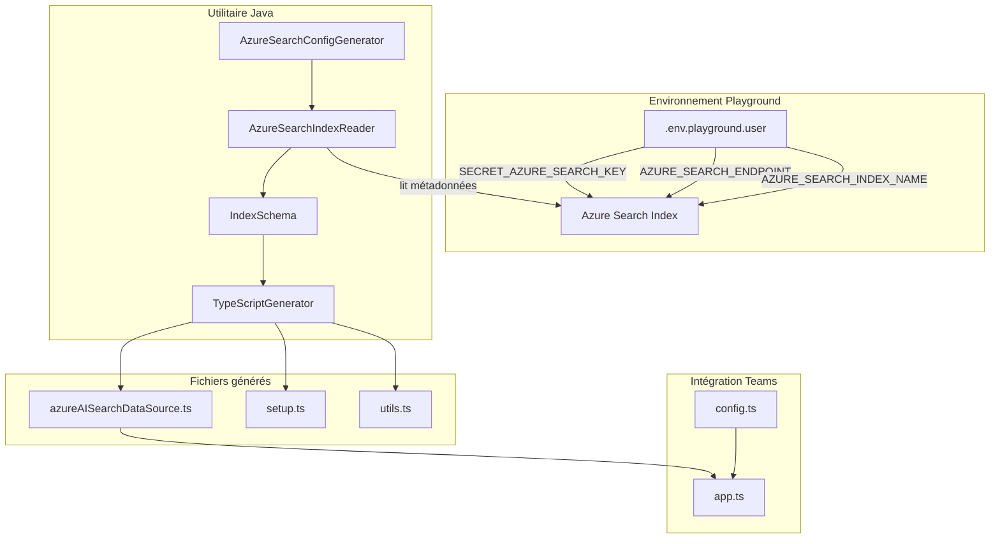
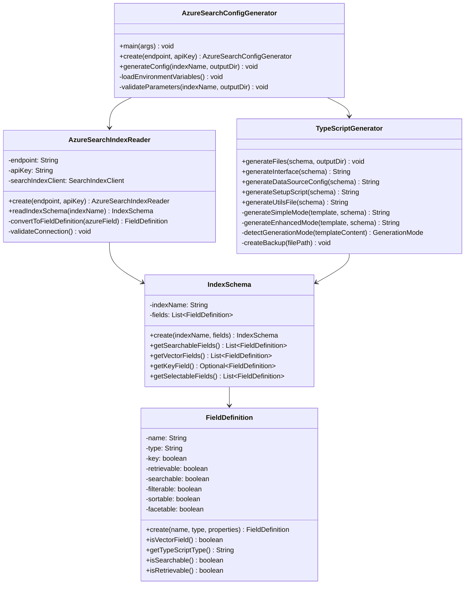
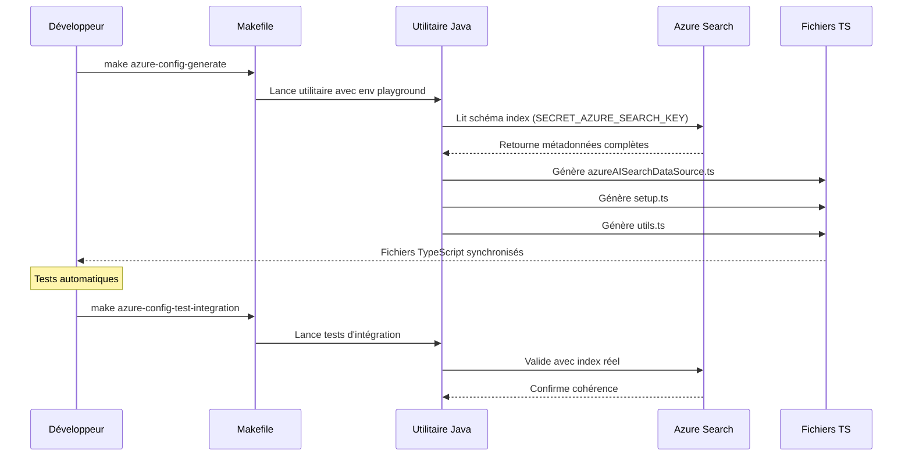

# Azure Search Configuration Generator

## Vue d'ensemble

L'utilitaire **Azure Search Configuration Generator** permet de lire automatiquement la structure d'un index Azure Search déployé et de générer les fichiers TypeScript correspondants pour le chatbot Legis QC. Cet outil suit les principes TDD (Test-Driven Development) et garantit une synchronisation parfaite entre l'index Azure Search et le code TypeScript.

## Architecture



## Fonctionnalités

### ✅ Lecture automatique des métadonnées
- Connexion sécurisée à Azure Search avec les clés du playground
- Analyse complète du schéma d'index (champs, types, propriétés)
- Détection automatique des champs clés, recherchables et vectoriels
- Gestion robuste des erreurs (index inexistant, authentification, etc.)

### ✅ Génération TypeScript intelligente
- **Interface TypeScript** typée selon le schéma réel
- **Configuration AzureAISearchDataSource** optimisée
- **Scripts de setup** adaptés aux champs détectés
- **Fonctions utilitaires** spécialisées

### ✅ Tests complets (67 tests)
- **Tests unitaires** (59) : Logique métier pure avec mocks
- **Tests d'intégration** (8) : Validation avec Azure Search réel
- **Couverture complète** : Edge cases, validation, gestion d'erreurs

## Structure du code



## Variables d'environnement requises

L'utilitaire utilise les variables définies dans `env/.env.playground.user` :

```bash
# Authentification Azure Search
SECRET_AZURE_SEARCH_KEY=YDcIo6Do1dEXTwLXEcuXLCdEQMELiXn3Q7HDhwrxEAAzSeD3CIr6
AZURE_SEARCH_ENDPOINT=https://search-cotechnoe-ai.search.windows.net
AZURE_SEARCH_INDEX_NAME=legis-qc-index-01

# Authentification Azure OpenAI (pour les embeddings)
SECRET_AZURE_OPENAI_API_KEY=2ad1VT9CKCOgRAetxF9BCE03VfYrDIZ0L95KRB7IFaZFu4gW9nebJQQJ99BAACHYHv6XJ3w3AAABACOGsefB
AZURE_OPENAI_ENDPOINT=https://openai-cotechnoe.openai.azure.com/
AZURE_OPENAI_EMBEDDING_DEPLOYMENT_NAME=text-embedding-ada-002
```

## Utilisation

### Via Makefile (recommandé)

```bash
# Génération complète avec l'index playground
make azure-config-generate

# Génération avec index spécifique
make azure-config-generate INDEX_NAME=mon-index

# Validation de la configuration
make azure-config-validate

# Tests d'intégration avec Azure Search réel
make azure-config-test-integration
```

### Via Java directement

```bash
# Compilation
mvn compile

# Exécution avec variables playground
java -cp target/classes:$(mvn dependency:build-classpath -q -Dmdep.outputFile=/dev/stdout) \
  com.cotechnoe.teamsrag.indexconfigurator.AzureSearchConfigGenerator

# Avec paramètres personnalisés
java -cp target/classes:$(mvn dependency:build-classpath -q -Dmdep.outputFile=/dev/stdout) \
  com.cotechnoe.teamsrag.indexconfigurator.AzureSearchConfigGenerator \
  --endpoint=https://search.windows.net \
  --api-key=your-key \
  --index-name=your-index \
  --output-dir=./src/indexers
```

## Fichiers générés

### azureAISearchDataSource.ts
Interface TypeScript et configuration de la source de données :

```typescript
export interface MyDocument {
    docId?: string;
    docTitle?: string | null;
    description?: string | null;
    descriptionVector?: number[] | null;
}

export const azureAISearchDataSource = new AzureAISearchDataSource({
    name: "azure-ai-search",
    indexName: config.azureSearchIndexName,
    searchFields: ["docTitle", "description"],
    select: ["docId", "docTitle", "description"],
    vectorFields: ["descriptionVector"],
    // ... configuration complète
});
```

### setup.ts
Script de création et peuplement d'index :

```typescript
export async function main() {
    const index = config.azureSearchIndexName;
    
    // Validation des variables d'environnement
    // Création du client Azure Search
    // Logique de peuplement adaptée au schéma
}
```

### utils.ts
Fonctions utilitaires spécialisées :

```typescript
export async function createIndexIfNotExists(client: SearchIndexClient, indexName: string): Promise<void>
export async function upsertDocuments(client: SearchClient<MyDocument>, documents: MyDocument[]): Promise<void>
export async function getEmbeddingVector(text: string): Promise<number[]>
```

## Workflow de développement



## Tests et validation

### Tests unitaires (TDD)
```bash
# Tous les tests (67 tests)
mvn test

# Tests spécifiques
mvn test -Dtest="AzureSearchIndexReaderTest"
mvn test -Dtest="TypeScriptGeneratorTest"
```

### Tests d'intégration avec Azure Search réel
```bash
# Nécessite les variables playground
mvn verify

# Ou via Makefile
make azure-config-test-integration
```

### Couverture des tests

- ✅ **AzureSearchIndexReader** (18 tests) : Lecture métadonnées, gestion erreurs
- ✅ **TypeScriptGenerator** (5+3 tests) : Génération code, intégration
- ✅ **IndexSchema & FieldDefinition** (26 tests) : Modèles immutables
- ✅ **AzureSearchConfigGenerator** (6 tests) : Orchestration
- ✅ **Gestion d'erreurs** (2 tests) : Exceptions spécialisées
- ✅ **Tests d'intégration** (8 tests) : Validation Azure Search réel

## Troubleshooting

### Erreurs courantes

**Erreur d'authentification**
```
AzureSearchConnectionException: Authentication failed - invalid API key
```
→ Vérifier `SECRET_AZURE_SEARCH_KEY` dans `.env.playground.user`

**Index non trouvé**
```
AzureSearchConnectionException: Index not found: mon-index
```
→ Vérifier `AZURE_SEARCH_INDEX_NAME` et l'existence de l'index

**Variables manquantes**
```
IllegalArgumentException: Endpoint cannot be null or empty
```
→ Exécuter `make env-check` pour valider la configuration

### Debug et logging

```bash
# Mode verbose
make azure-config-generate VERBOSE=true

# Validation configuration
make azure-config-validate

# Diagnostic complet
make diagnostic
```

## Intégration avec le projet Legis QC

L'utilitaire s'intègre parfaitement dans l'écosystème existant :

1. **Variables playground** : Utilise la configuration existante
2. **Structure config.ts** : Compatible avec le système de configuration
3. **Makefile** : Nouvelles règles intégrées harmonieusement
4. **Tests** : Respecte les conventions TDD du projet

## Évolutions futures

- Support de plusieurs index simultanément
- Génération de scripts de migration
- Intégration avec CI/CD pour validation automatique
- Support des index avec schémas complexes (nested objects)
- Interface CLI avancée avec options