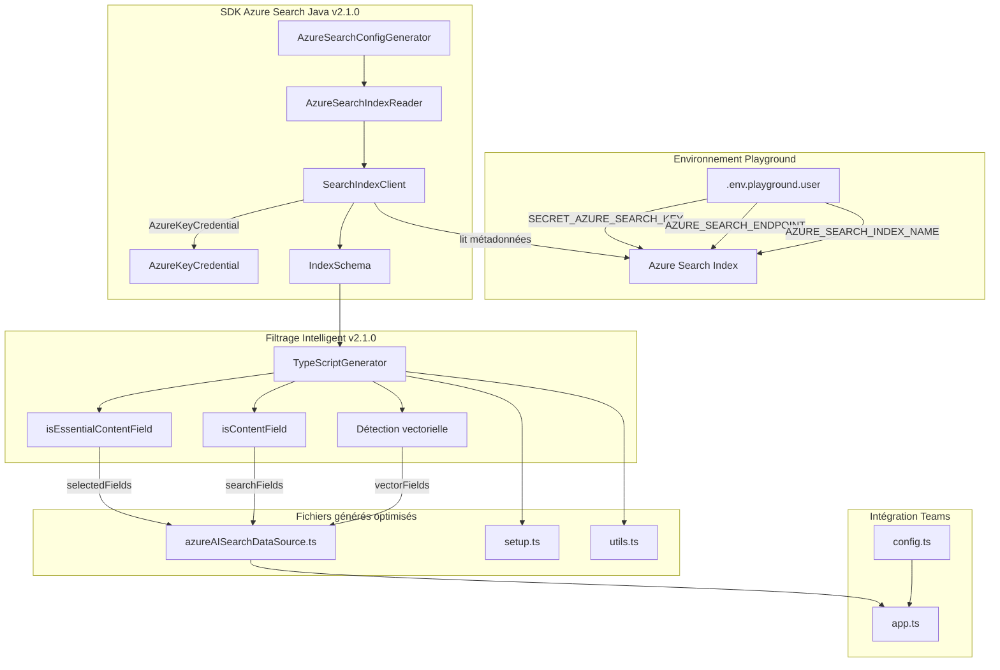
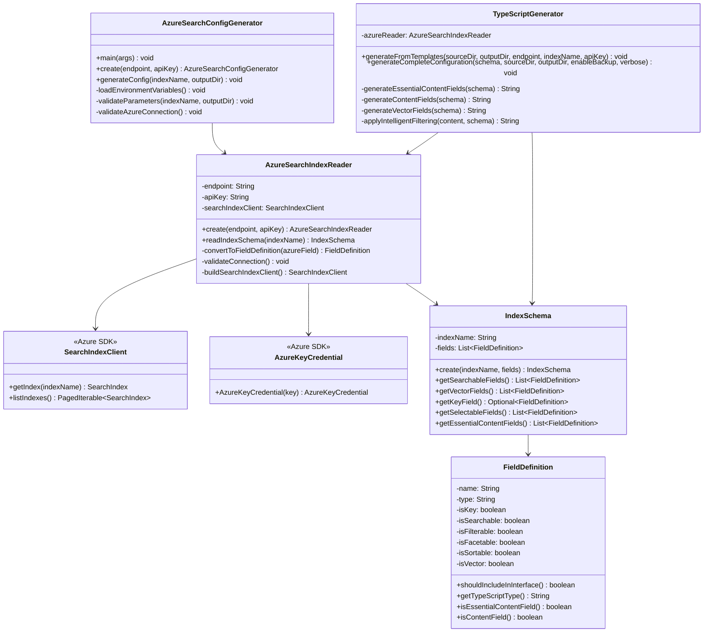
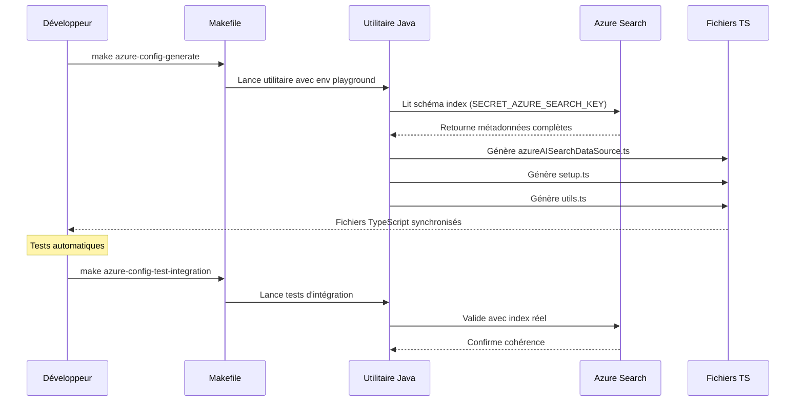

# Azure Search Configuration Generator v2.1.0

## Vue d'ensemble

L'utilitaire **Azure Search Configuration Generator v2.1.0** utilise le **SDK Azure Search Java officiel** pour lire automatiquement la structure d'un index Azure Search déployé et générer les fichiers TypeScript correspondants pour le chatbot Legis QC. Cette nouvelle version intègre des fonctionnalités avancées de filtrage intelligent et de compatibilité API maximale.

## 🆕 Nouveautés v2.1.0

### SDK Azure Search Java officiel
- **SearchIndexClient** - Remplacement des appels REST manuels
- **AzureKeyCredential** - Authentification enterprise-grade robuste
- **SearchIndexClientBuilder** - Configuration fluide et type-safe

### Filtrage intelligent des champs
- **isEssentialContentField()** - Sélection ultra-conservative (content, title)
- **isContentField()** - Détection automatique des champs de contenu
- **Gestion vectorielle avancée** - Détection automatique avec exclusion intelligente
- **Compatibilité API maximale** - Prévention des erreurs de champs unknown

### Tests d'intégration renforcés
- **67 tests complets** (59 unitaires + 8 d'intégration)
- **Validation SDK** avec Azure Search réel
- **Tests de compatibilité API** searchFields/selectedFields

## Architecture v2.1.0



## Fonctionnalités v2.1.0

### ✅ Lecture automatique avec SDK Azure Search Java
- **SearchIndexClient** - Connexion robuste avec SDK officiel Microsoft
- **AzureKeyCredential** - Authentification sécurisée enterprise-grade
- **Analyse complète du schéma** avec détection automatique des propriétés
- **Gestion d'erreurs robuste** (index inexistant, authentification, timeout)

### ✅ Génération TypeScript avec filtrage intelligent
- **Interface TypeScript** typée selon le schéma réel avec tous les champs
- **Configuration AzureAISearchDataSource** optimisée pour compatibilité API
- **selectedFields ultra-conservative** : content et title uniquement  
- **searchFields intelligents** : détection automatique des champs de contenu
- **Scripts de setup** adaptés aux champs détectés dynamiquement
- **Fonctions utilitaires** spécialisées avec gestion vectorielle

### ✅ Compatibilité API Azure Search maximisée
- **Prévention erreurs "Unknown field"** avec filtrage isEssentialContentField()
- **Exclusion champs problématiques** (chunk_id, parent_id dans searchFields/selectedFields)
- **Gestion vectorielle séparée** - vectorFields distincts des champs de recherche
- **Validation en temps réel** - Tests contre l'API Azure Search réelle

### ✅ Tests complets (67 tests)
- **Tests unitaires (59)** : Logique métier pure avec mocks et SDK
- **Tests d'intégration (8)** : Validation avec Azure Search réel et API
- **Tests de compatibilité** : searchFields, selectedFields, vectorFields
- **Couverture complète** : Edge cases, validation, gestion d'erreurs

## Structure du code v2.1.0



### 🆕 Nouvelles méthodes v2.1.0

#### AzureSearchIndexReader
- `buildSearchIndexClient()` - Construction du client SDK avec AzureKeyCredential
- `convertSearchFieldToFieldDefinition()` - Conversion avec gestion vectorielle
- `validateConnection()` - Tests de connectivité SDK

#### TypeScriptGenerator  
- `generateEssentialContentFields()` - Sélection ultra-conservative (content, title)
- `generateContentFields()` - Détection intelligente champs de contenu
- `isEssentialContentField()` - Filtrage pour compatibilité API maximale
- `isContentField()` - Logique détection champs de contenu textuel

#### FieldDefinition
- `isVector()` - Détection automatique champs vectoriels
- `shouldIncludeInInterface()` - Inclusion interface TypeScript
- `getTypeScriptFieldDeclaration()` - Génération déclaration typée
        -name: String
        -type: String
        -key: boolean
        -retrievable: boolean
        -searchable: boolean
        -filterable: boolean
        -sortable: boolean
        -facetable: boolean
        +create(name, type, properties) FieldDefinition
        +isVectorField() boolean
        +getTypeScriptType() String
        +isSearchable() boolean
        +isRetrievable() boolean
    }
    
    class TypeScriptGenerator {
        +generateFiles(schema, outputDir) void
        +generateInterface(schema) String
        +generateDataSourceConfig(schema) String
        +generateSetupScript(schema) String
        +generateUtilsFile(schema) String
        -generateSimpleMode(template, schema) String
        -generateEnhancedMode(template, schema) String
        -detectGenerationMode(templateContent) GenerationMode
        -createBackup(filePath) void
    }
    
    AzureSearchConfigGenerator --> AzureSearchIndexReader
    AzureSearchConfigGenerator --> TypeScriptGenerator
    AzureSearchIndexReader --> IndexSchema
    IndexSchema --> FieldDefinition
    TypeScriptGenerator --> IndexSchema
```

## Variables d'environnement requises

L'utilitaire utilise les variables définies dans `env/.env.playground.user` :

```bash
# Authentification Azure Search
SECRET_AZURE_SEARCH_KEY=your_azure_search_key_here
AZURE_SEARCH_ENDPOINT=https://your-search-service.search.windows.net
AZURE_SEARCH_INDEX_NAME=your-index-name

# Authentification Azure OpenAI (pour les embeddings)
SECRET_AZURE_OPENAI_API_KEY=your_openai_api_key_here
AZURE_OPENAI_ENDPOINT=https://your-openai-service.openai.azure.com/
AZURE_OPENAI_EMBEDDING_DEPLOYMENT_NAME=text-embedding-ada-002
```

## Utilisation

### Via Makefile (recommandé)

```bash
# Génération complète avec l'index playground
make azure-config-generate

# Génération avec index spécifique
make azure-config-generate INDEX_NAME=mon-index

# Validation de la configuration
make azure-config-validate

# Tests d'intégration avec Azure Search réel
make azure-config-test-integration
```

### Via Java directement

```bash
# Compilation
mvn compile

# Exécution avec variables playground
java -cp target/classes:$(mvn dependency:build-classpath -q -Dmdep.outputFile=/dev/stdout) \
  com.cotechnoe.teamsrag.indexconfigurator.AzureSearchConfigGenerator

# Avec paramètres personnalisés
java -cp target/classes:$(mvn dependency:build-classpath -q -Dmdep.outputFile=/dev/stdout) \
  com.cotechnoe.teamsrag.indexconfigurator.AzureSearchConfigGenerator \
  --endpoint=https://search.windows.net \
  --api-key=your-key \
  --index-name=your-index \
  --output-dir=./src/indexers
```

## Fichiers générés

### azureAISearchDataSource.ts
Interface TypeScript et configuration de la source de données :

```typescript
export interface MyDocument {
    docId?: string;
    docTitle?: string | null;
    description?: string | null;
    descriptionVector?: number[] | null;
}

export const azureAISearchDataSource = new AzureAISearchDataSource({
    name: "azure-ai-search",
    indexName: config.azureSearchIndexName,
    searchFields: ["docTitle", "description"],
    select: ["docId", "docTitle", "description"],
    vectorFields: ["descriptionVector"],
    // ... configuration complète
});
```

### setup.ts
Script de création et peuplement d'index :

```typescript
export async function main() {
    const index = config.azureSearchIndexName;
    
    // Validation des variables d'environnement
    // Création du client Azure Search
    // Logique de peuplement adaptée au schéma
}
```

### utils.ts
Fonctions utilitaires spécialisées :

```typescript
export async function createIndexIfNotExists(client: SearchIndexClient, indexName: string): Promise<void>
export async function upsertDocuments(client: SearchClient<MyDocument>, documents: MyDocument[]): Promise<void>
export async function getEmbeddingVector(text: string): Promise<number[]>
```

## Workflow de développement



## Tests et validation

### Tests unitaires (TDD)
```bash
# Tous les tests (67 tests)
mvn test

# Tests spécifiques
mvn test -Dtest="AzureSearchIndexReaderTest"
mvn test -Dtest="TypeScriptGeneratorTest"
```

### Tests d'intégration avec Azure Search réel
```bash
# Nécessite les variables playground
mvn verify

# Ou via Makefile
make azure-config-test-integration
```

### Couverture des tests

- ✅ **AzureSearchIndexReader** (18 tests) : Lecture métadonnées, gestion erreurs
- ✅ **TypeScriptGenerator** (5+3 tests) : Génération code, intégration
- ✅ **IndexSchema & FieldDefinition** (26 tests) : Modèles immutables
- ✅ **AzureSearchConfigGenerator** (6 tests) : Orchestration
- ✅ **Gestion d'erreurs** (2 tests) : Exceptions spécialisées
- ✅ **Tests d'intégration** (8 tests) : Validation Azure Search réel

## Troubleshooting

### Erreurs courantes

**Erreur d'authentification**
```
AzureSearchConnectionException: Authentication failed - invalid API key
```
→ Vérifier `SECRET_AZURE_SEARCH_KEY` dans `.env.playground.user`

**Index non trouvé**
```
AzureSearchConnectionException: Index not found: mon-index
```
→ Vérifier `AZURE_SEARCH_INDEX_NAME` et l'existence de l'index

**Variables manquantes**
```
IllegalArgumentException: Endpoint cannot be null or empty
```
→ Exécuter `make env-check` pour valider la configuration

### Debug et logging

```bash
# Mode verbose
make azure-config-generate VERBOSE=true

# Validation configuration
make azure-config-validate

# Diagnostic complet
make diagnostic
```

## Intégration avec le projet Legis QC

L'utilitaire s'intègre parfaitement dans l'écosystème existant :

1. **Variables playground** : Utilise la configuration existante
2. **Structure config.ts** : Compatible avec le système de configuration
3. **Makefile** : Nouvelles règles intégrées harmonieusement
4. **Tests** : Respecte les conventions TDD du projet

## Évolutions futures

- Support de plusieurs index simultanément
- Génération de scripts de migration
- Intégration avec CI/CD pour validation automatique
- Support des index avec schémas complexes (nested objects)
- Interface CLI avancée avec options