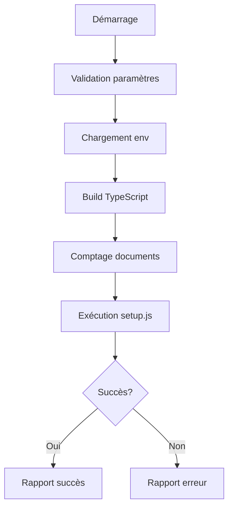

# 🔧 Scripts de gestion - Référence technique

Documentation technique détaillée des scripts de gestion de l'index Azure AI Search.

## 📁 Vue d'ensemble des scripts

| Script | Fonction | Complexité |
|--------|----------|------------|
| `env-check.sh` | Validation environnement | 🟢 Simple |
| `config-validate.sh` | Test connectivité Azure | 🟡 Moyen |
| `index-setup.sh` | Création et indexation | 🔴 Complexe |
| `index-delete.sh` | Suppression d'index | 🟡 Moyen |
| `documents-add.sh` | Ajout documents | 🔴 Complexe |
| `index-status-check.sh` | Monitoring index | 🟡 Moyen |

## 🔍 Analyse détaillée des scripts

### 1. env-check.sh

**Objectif** : Valider la présence et la validité des variables d'environnement.

#### Variables vérifiées
```bash
# Obligatoires
AZURE_SEARCH_ENDPOINT
AZURE_OPENAI_ENDPOINT  
AZURE_OPENAI_DEPLOYMENT_NAME

# Optionnelles mais recommandées
AZURE_OPENAI_EMBEDDING_DEPLOYMENT_NAME

# IMPORTANT: Variables avec préfixe SECRET_
# Variables sensibles masquées dans les logs
SECRET_AZURE_OPENAI_API_KEY     # Clé API Azure OpenAI (sensible)
SECRET_AZURE_SEARCH_KEY         # Clé d'accès Azure Search (sensible)

# Variables standard sans préfixe SECRET_
AZURE_SEARCH_INDEX_NAME         # Nom de l'index (non sensible)
AZURE_SEARCH_ENDPOINT           # URL du service (non sensible)
```

#### ⚠️ Convention de sécurité des variables
**IMPORTANT** : Les variables sensibles utilisent le préfixe `SECRET_` selon les conventions Microsoft 365 Agents Toolkit :

- **❌ N'utilisez pas** : `AZURE_OPENAI_API_KEY` (visible dans les logs)  
- **✅ Utilisez** : `SECRET_AZURE_OPENAI_API_KEY` (masquée dans les logs)

- **✅ Variable standard** : `AZURE_SEARCH_INDEX_NAME` (nom d'index non sensible)

Ces variables `SECRET_*` sont automatiquement masquées dans les logs et bénéficient d'un traitement sécurisé.

#### Logique de validation
1. **Existence** : Vérification de la définition des variables
2. **Valeur non vide** : Détection des variables vides
3. **Format** : Validation basique du format des endpoints
4. **Rapport** : Affichage masqué des secrets

#### Codes de sortie
- `0` : Toutes les variables requises sont présentes
- `1` : Variables manquantes ou vides

#### Utilisation
```bash
# Validation automatique
make env-check

# Validation manuelle
./scripts/env-check.sh
```

### 2. config-validate.sh

**Objectif** : Tester la connectivité et la configuration des services Azure.

#### Tests effectués
1. **Connectivité Azure Search**
   ```bash
   curl -s -o /dev/null -w "%{http_code}" \
     "$AZURE_SEARCH_ENDPOINT/indexes?api-version=2023-11-01"
   ```

2. **Connectivité Azure OpenAI**
   ```bash
   curl -s -o /dev/null -w "%{http_code}" \
     "$AZURE_OPENAI_ENDPOINT/openai/deployments?api-version=2023-05-15"
   ```

3. **Validation des données**
   - Existence du répertoire `src/indexers/data`
   - Comptage des documents `.md`
   - Vérification des noms de déploiement

#### Codes de réponse HTTP
- `200` : Service accessible avec authentification
- `401` : Service accessible, authentification requise ✅
- `403` : Service accessible, permissions insuffisantes
- `404` : Endpoint introuvable ❌
- `000` : Service inaccessible ❌

#### Dépendances
- `curl` : Requis
- `jq` : Optionnel (formatage JSON)

### 3. index-setup.sh

**Objectif** : Processus complet de création d'index et d'indexation des documents.

#### Workflow détaillé


#### Gestion des clés chiffrées
```bash
if [[ "$SECRET_AZURE_SEARCH_KEY" == crypto_* ]]; then
    echo "🔓 Decrypting Azure Search key..."
    # Implémentation de déchiffrement requise
fi
```

#### Validation des prérequis
1. **Arguments** : Vérification des clés API
2. **Build** : Compilation TypeScript si nécessaire
3. **Données** : Comptage des documents source
4. **Répertoire** : Navigation vers `dist/indexers`

#### Rapports de progression
- 🚀 Démarrage du processus
- 📋 Chargement de l'environnement
- 📦 Build du projet
- 📊 Statistiques des documents
- 🔄 Exécution de l'indexation
- ✅ Confirmation de succès

### 4. index-delete.sh

**Objectif** : Suppression sécurisée de l'index Azure Search.

#### Mécanismes de sécurité
1. **Confirmation interactive**
   ```bash
   read -p "Are you sure you want to continue? (y/N): " -n 1 -r
   if [[ ! $REPLY =~ ^[Yy]$ ]]; then
       exit 1
   fi
   ```

2. **Avertissements explicites**
   - Affichage du nom de l'index
   - Mention de la perte de données
   - Confirmation requise

#### Workflow de suppression
1. Validation des paramètres
2. Chargement de l'environnement
3. Build si nécessaire
4. Avertissement et confirmation
5. Exécution de `delete.js`
6. Rapport de succès/échec

### 5. documents-add.sh

**Objectif** : Ajout incrémental de nouveaux documents à l'index existant.

#### Architecture de gestion des documents
```
src/indexers/
├── data/           # Documents actuels dans l'index
├── new-data/       # Nouveaux documents à indexer
└── processed/      # Archive des documents traités
    └── 20240822_143022/  # Horodatage
```

#### Workflow complexe
1. **Validation** des paramètres et environnement
2. **Création** du répertoire `new-data` si absent
3. **Détection** des nouveaux documents
4. **Sauvegarde** temporaire des données existantes
5. **Fusion** des nouveaux documents
6. **Indexation** complète
7. **Archivage** des documents traités
8. **Restauration** en cas d'échec

#### Gestion des erreurs
```bash
if node setup.js "$SECRET_AZURE_SEARCH_KEY" "$SECRET_AZURE_OPENAI_API_KEY"; then
    # Succès : archivage
    mv "$NEW_DOCS_DIR"/*.md "$ARCHIVE_DIR/"
else
    # Échec : restauration
    rm -f "$DATA_DIR"/*.md
    cp "$TEMP_BACKUP_DIR"/* "$DATA_DIR/"
fi
```

### 6. index-status-check.sh

**Objectif** : Monitoring et diagnostic de l'état de l'index.

#### APIs utilisées
1. **Existence de l'index**
   ```bash
   GET /indexes/{index-name}?api-version=2023-11-01
   ```

2. **Comptage des documents**
   ```bash
   GET /indexes/{index-name}/docs/$count?api-version=2023-11-01
   ```

3. **Statistiques de l'index**
   ```bash
   GET /indexes/{index-name}/stats?api-version=2023-11-01
   ```

#### Métriques rapportées
- **Existence** : Index présent/absent
- **Documents** : Nombre total de documents
- **Stockage** : Taille en octets
- **Statut** : État général de l'index

#### Formatage des données
```bash
if command -v jq >/dev/null 2>&1; then
    # Formatage JSON avec jq
    echo "Storage size: $(echo "$stats" | jq -r '.storageSize')"
else
    # Affichage brut
    echo "Raw stats: $stats"
fi
```

## 🛡️ Sécurité et bonnes pratiques

### Gestion des secrets
```bash
# Masquage dans les logs
echo "API Key: ${API_KEY:0:8}..."

# Variables sensibles non exposées
export SECRET_AZURE_SEARCH_KEY="$1"  # Paramètre, pas variable d'env
```

### Validation des entrées
```bash
# Vérification de la présence des arguments
if [[ -z "$SECRET_AZURE_SEARCH_KEY" ]]; then
    echo "❌ Usage: $0 <azure_search_key>"
    exit 1
fi

# Validation du format des clés
if [[ ! "$SECRET_AZURE_SEARCH_KEY" =~ ^[A-Za-z0-9+/=]{40,}$ ]]; then
    echo "⚠️  Warning: Key format may be invalid"
fi
```

### Gestion des erreurs
```bash
# Arrêt immédiat en cas d'erreur
set -e

# Gestion des codes de sortie
if [[ $? -eq 0 ]]; then
    echo "✅ Success"
else
    echo "❌ Failed"
    exit 1
fi
```

## 🔧 Personnalisation et extension

### Variables configurables
```bash
# Dans Makefile
INDEX_NAME ?= my-documents
NODE_ENV ?= development
API_VERSION ?= 2023-11-01
```

### Ajout de nouveaux scripts
1. **Créer** le script dans `scripts/`
2. **Ajouter** au Makefile
3. **Documenter** dans `docs/`
4. **Rendre exécutable** : `chmod +x`

### Hooks personnalisés
```bash
# Pre-setup hook
if [[ -f "scripts/pre-setup.sh" ]]; then
    ./scripts/pre-setup.sh
fi

# Post-setup hook
if [[ -f "scripts/post-setup.sh" ]]; then
    ./scripts/post-setup.sh
fi
```

## 📊 Monitoring et observabilité

### Logs structurés
```bash
# Format standardisé
echo "$(date -Iseconds) [INFO] Starting index setup..."
echo "$(date -Iseconds) [ERROR] Failed to connect to Azure"
```

### Métriques collectées
- Temps d'exécution des scripts
- Nombre de documents traités
- Taille des index
- Codes de réponse HTTP

### Intégration CI/CD
```bash
# Variables d'environnement CI
CI_SECRET_AZURE_SEARCH_KEY=${CI_AZURE_SEARCH_KEY}
CI_SECRET_AZURE_OPENAI_API_KEY=${CI_AZURE_OPENAI_KEY}

# Exécution non-interactive
export DEBIAN_FRONTEND=noninteractive
make setup-index
```

## 🎯 Optimisations et performance

### Parallélisation
```bash
# Traitement parallèle des documents
for file in *.md; do
    process_document "$file" &
done
wait  # Attendre tous les processus
```

### Cache et optimisations
```bash
# Cache des embeddings
CACHE_DIR=".cache/embeddings"
if [[ -f "$CACHE_DIR/$file_hash" ]]; then
    read cached_embedding < "$CACHE_DIR/$file_hash"
fi
```

### Batch processing
```bash
# Traitement par lots
BATCH_SIZE=10
for ((i=0; i<${#files[@]}; i+=BATCH_SIZE)); do
    batch=("${files[@]:i:BATCH_SIZE}")
    process_batch "${batch[@]}"
done
```
